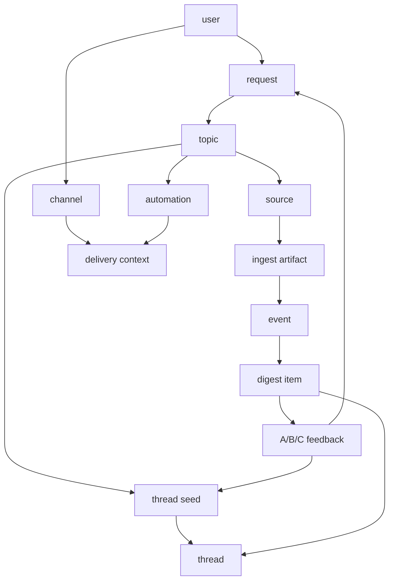

# Skrya Domain Model

Skrya is topic-driven. The important entities are:

| Entity | Meaning |
| --- | --- |
| `topic` | A durable tracking area, such as BYD/new energy/storage. |
| `topic-id` | The internal stable id for a topic. Agents resolve this before file work. |
| `request` | A durable user preference or tracked angle inside `brief.json`. |
| `source` | A confirmed source entry in `sources.json`. |
| `source candidate` | A proposed source that has not been confirmed yet. |
| `source channel` | A retrieval route such as web/news search, X, WeChat official accounts, site search, or document fetch. |
| `retrieval capability` | Provider-neutral capability labels such as `web_search`, `news_search`, `social_search`, and `document_fetch`. |
| `provider` | A runtime retrieval implementation. Provider names are traceability metadata, not durable dependencies. |
| `event` | A real-world occurrence or development. Digest items should represent events, not isolated articles. |
| `digest item` | A visible numbered event in a digest. |
| `thread` | A stable timeline below a topic and above individual digest items, used for continuing events. |
| `thread seed` | Durable config that names a thread, aliases it, and defines match terms/watchpoints. |
| `watchpoint` | A future condition worth monitoring for a request or thread. |
| `template` | The user-facing output contract for digests, analysis, and setup flows. |
| `data root` | The runtime storage root, usually `~/.skrya` or workspace `.skrya/data`. |
| `topic file` | Durable per-topic files: `topic.json`, `brief.json`, `sources.json`, `digest.md`, `deep-analysis.md`, and optional `thread-seeds.json`. |
| `run` | Generated runtime state under `<skrya-data-root>/runs/<topic-id>/`. |
| `ingest artifact` | Normalized retrieval output, especially `skrya.ingest.v1`. |
| `digest artifact` | Saved digest markdown and index files for later continuation. |
| `deep-analysis artifact` | Saved analysis output for a digest item. |
| `thread artifact` | Runtime thread timelines, normally `threads/latest-threads.json`. |
| `test run` | A preview digest that follows the real template but is not saved by default. |
| `provenance` | Enough source traceability to answer "where did this come from?" later. |
| `user` | The person whose topic preferences and automation intent are being served. |
| `channel` | A conversation/channel binding exposed by some hosts. Required for delivery isolation when available. |
| `delivery context` | The topic plus user/channel/workspace binding used for scheduled delivery and resend. |
| `automation` | A recurring task that generates and/or sends a digest. |
| `schedule` | The recurrence and timezone for automation. |
| `send verification` | A post-send check that delivered body content was non-empty. |
| `feedback command` | Digest continuation shorthand: `A` deep analysis, `B` thread, `C` durable preference update. |
| `skill pack` | The installable Skrya repository shape. |
| `umbrella skill` | The root Skrya skill that routes to bundled skills. |
| `bundled skill` | A focused subskill such as `topic-curation`, `source-curation`, `digest`, or `deep-analysis`. |
| `prompt pack` | Host-specific instruction artifacts generated from `prompt-templates/`. |
| `host artifact` | Generated packaging output under `.skrya/hosts/`. |
| `instruction memory` | Host-level persistent guidance such as `AGENTS.md`, `CLAUDE.md`, `TOOLS.md`, or documented global memory. |
| `upgrade flow` | A readable procedure and CLI path for updating code and migrating runtime data. |

Relationships:

